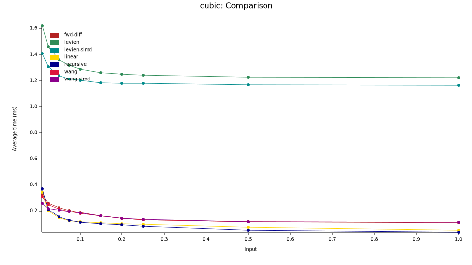

# Performance

To run the benchmarks: `cargo bench`

The benchmark will pull all of the curves from the SVG documents in the `assets` directory. Use the `FLATTEN_INPUT` environment variable to apply a filter. For example:

```bash
FLATTEN_INPUT=nehab_ cargo bench
```

Will only use the files with "nehab_" in their name.

Benchmark results on an AMD Ryzen 7 PRO 6850U laptop:


Benchmark results on an AMD Ryzen Threadripper PRO 3975WXs desktop:


Still on the AMD Ryzen Threadripper PRO 3975WXs desktop, let's focus on fewer algorithms and more specific test cases:

`fonts-12.svg`:



GhostScript tiger:


Nehab test set:


