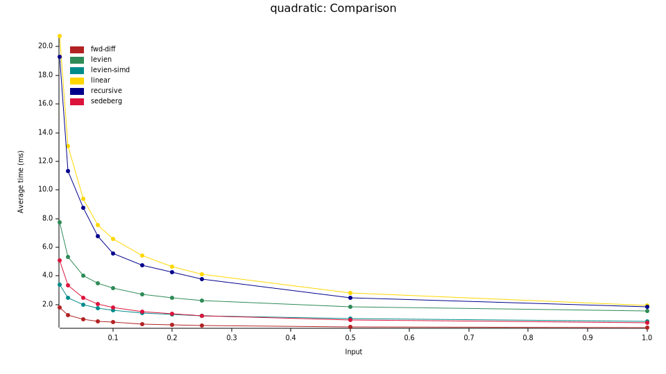

# Caveats

- I suspect that there may be a bug in `hain`'s implementation, so the results for that one are probably wrong.
- `levien-simd` was a half-baked attempt at sprinkling some sse in `levien`'s algorithm with underwhelming results. Raph levien has [a work in progress](https://gist.github.com/raphlinus/5f4e9feb85fd79bafc72da744571ec0e) avx2 version that is more promising.

# Performance

To run the benchmakrs: `cargo bench --features=testing`

Benchmark results on an AMD Ryzen 7 PRO 6850U:


```
cubic/recursive/0.01    time:   [597.02 µs 597.63 µs 598.34 µs]
cubic/fwd-iff/0.01      time:   [110.54 µs 110.71 µs 110.91 µs]
cubic/hfd/0.01          time:   [522.42 µs 523.04 µs 523.76 µs]
cubic/hain/0.01         time:   [1.0067 ms 1.0084 ms 1.0104 ms]
cubic/levien/0.01       time:   [686.06 µs 686.82 µs 687.72 µs]
cubic/linear/0.01       time:   [673.28 µs 674.34 µs 675.69 µs]
cubic/sedeberg/0.01     time:   [115.65 µs 115.82 µs 116.05 µs]

cubic/recursive/0.025   time:   [369.49 µs 369.94 µs 370.46 µs]
cubic/fwd-iff/0.025     time:   [81.150 µs 81.242 µs 81.350 µs]
cubic/hfd/0.025         time:   [362.59 µs 363.42 µs 364.21 µs]
cubic/hain/0.025        time:   [655.83 µs 656.54 µs 657.46 µs]
cubic/levien/0.025      time:   [480.45 µs 480.92 µs 481.44 µs]
cubic/linear/0.025      time:   [413.91 µs 414.71 µs 415.63 µs]
cubic/sedeberg/0.025    time:   [84.100 µs 84.185 µs 84.281 µs]

cubic/recursive/0.05    time:   [249.71 µs 250.04 µs 250.45 µs]
cubic/fwd-iff/0.05      time:   [65.905 µs 65.963 µs 66.029 µs]
cubic/hfd/0.05          time:   [272.77 µs 273.14 µs 273.55 µs]
cubic/hain/0.05         time:   [478.01 µs 478.47 µs 479.00 µs]
cubic/levien/0.05       time:   [373.88 µs 374.49 µs 375.18 µs]
cubic/linear/0.05       time:   [258.77 µs 259.40 µs 260.15 µs]
cubic/sedeberg/0.05     time:   [67.525 µs 67.589 µs 67.662 µs]

cubic/recursive/0.075   time:   [204.30 µs 204.51 µs 204.73 µs]
cubic/fwd-iff/0.075     time:   [58.650 µs 58.708 µs 58.775 µs]
cubic/hfd/0.075         time:   [224.52 µs 224.86 µs 225.28 µs]
cubic/hain/0.075        time:   [399.90 µs 400.67 µs 401.62 µs]
cubic/levien/0.075      time:   [321.49 µs 321.87 µs 322.30 µs]
cubic/linear/0.075      time:   [201.34 µs 201.71 µs 202.13 µs]
cubic/sedeberg/0.075    time:   [59.003 µs 59.055 µs 59.116 µs]

cubic/recursive/0.1     time:   [176.05 µs 176.23 µs 176.41 µs]
cubic/fwd-iff/0.1       time:   [54.213 µs 54.271 µs 54.344 µs]
cubic/hfd/0.1           time:   [197.78 µs 198.05 µs 198.33 µs]
cubic/hain/0.1          time:   [350.09 µs 350.61 µs 351.20 µs]
cubic/levien/0.1        time:   [289.42 µs 289.79 µs 290.20 µs]
cubic/linear/0.1        time:   [169.40 µs 169.66 µs 169.96 µs]
cubic/sedeberg/0.1      time:   [54.463 µs 54.589 µs 54.754 µs]

cubic/recursive/0.15    time:   [140.55 µs 140.92 µs 141.34 µs]
cubic/fwd-iff/0.15      time:   [48.710 µs 48.752 µs 48.800 µs]
cubic/hfd/0.15          time:   [166.01 µs 166.44 µs 166.91 µs]
cubic/hain/0.15         time:   [294.53 µs 295.18 µs 295.91 µs]
cubic/levien/0.15       time:   [249.06 µs 249.32 µs 249.61 µs]
cubic/linear/0.15       time:   [132.17 µs 132.36 µs 132.57 µs]
cubic/sedeberg/0.15     time:   [48.901 µs 48.947 µs 49.001 µs]

cubic/recursive/0.2     time:   [118.45 µs 118.68 µs 118.94 µs]
cubic/fwd-iff/0.2       time:   [44.816 µs 44.886 µs 44.965 µs]
cubic/hfd/0.2           time:   [144.42 µs 144.83 µs 145.26 µs]
cubic/hain/0.2          time:   [262.22 µs 262.48 µs 262.76 µs]
cubic/levien/0.2        time:   [224.06 µs 224.27 µs 224.53 µs]
cubic/linear/0.2        time:   [111.23 µs 111.41 µs 111.63 µs]
cubic/sedeberg/0.2      time:   [45.507 µs 45.575 µs 45.653 µs]

cubic/recursive/0.25    time:   [105.55 µs 105.66 µs 105.79 µs]
cubic/fwd-iff/0.25      time:   [42.186 µs 42.287 µs 42.428 µs]
cubic/hfd/0.25          time:   [128.09 µs 128.20 µs 128.32 µs]
cubic/hain/0.25         time:   [238.49 µs 238.91 µs 239.39 µs]
cubic/levien/0.25       time:   [205.76 µs 206.02 µs 206.31 µs]
cubic/linear/0.25       time:   [97.503 µs 97.639 µs 97.798 µs]
cubic/sedeberg/0.25     time:   [42.777 µs 42.823 µs 42.875 µs]

cubic/recursive/0.5     time:   [72.637 µs 72.778 µs 72.936 µs]
cubic/fwd-iff/0.5       time:   [34.306 µs 34.337 µs 34.371 µs]
cubic/hfd/0.5           time:   [95.164 µs 95.432 µs 95.756 µs]
cubic/hain/0.5          time:   [187.36 µs 187.49 µs 187.64 µs]
cubic/levien/0.5        time:   [160.78 µs 161.06 µs 161.40 µs]
cubic/linear/0.5        time:   [63.377 µs 63.467 µs 63.580 µs]
cubic/sedeberg/0.5      time:   [35.388 µs 35.476 µs 35.571 µs]

cubic/recursive/1       time:   [48.286 µs 48.334 µs 48.389 µs]
cubic/fwd-iff/1         time:   [28.378 µs 28.411 µs 28.447 µs]
cubic/hfd/1             time:   [71.398 µs 71.460 µs 71.534 µs]
cubic/hain/1            time:   [153.23 µs 153.44 µs 153.68 µs]
cubic/levien/1          time:   [124.91 µs 125.09 µs 125.31 µs]
cubic/linear/1          time:   [40.705 µs 40.769 µs 40.838 µs]
cubic/sedeberg/1        time:   [28.975 µs 29.022 µs 29.091 µs]
```



```
quadratic/recursive/0.01 time:   [403.35 µs 403.86 µs 404.49 µs]
quadratic/fwd-diff/0.01 time:    [89.051 µs 89.164 µs 89.307 µs]
quadratic/levien/0.01   time:    [223.21 µs 223.50 µs 223.85 µs]
quadratic/levien-simd/0.01 time: [168.78 µs 168.97 µs 169.19 µs]
quadratic/linear2/0.01  time:    [473.34 µs 473.77 µs 474.22 µs]
quadratic/sedeberg/0.01 time:    [205.24 µs 205.43 µs 205.63 µs]

quadratic/recursive/0.025 time:  [245.77 µs 246.11 µs 246.52 µs]
quadratic/fwd-diff/0.025 time:   [60.787 µs 61.003 µs 61.265 µs]
quadratic/levien/0.025  time:    [173.09 µs 173.49 µs 174.02 µs]
quadratic/levien-simd/0.025 time: [141.61 µs 141.78 µs 141.97 µs]
quadratic/linear2/0.025 time:    [277.25 µs 277.62 µs 278.05 µs]
quadratic/sedeberg/0.025 time:   [145.43 µs 145.61 µs 145.86 µs]

quadratic/recursive/0.05 time:   [156.36 µs 156.59 µs 156.84 µs]
quadratic/fwd-diff/0.05 time:    [50.384 µs 50.509 µs 50.664 µs]
quadratic/levien/0.05   time:    [143.17 µs 143.52 µs 143.94 µs]
quadratic/levien-simd/0.05 time: [124.23 µs 124.33 µs 124.45 µs]
quadratic/linear2/0.05  time:    [166.50 µs 166.76 µs 167.04 µs]
quadratic/sedeberg/0.05 time:    [112.69 µs 112.82 µs 112.99 µs]

quadratic/recursive/0.075 time:  [118.84 µs 119.01 µs 119.23 µs]
quadratic/fwd-diff/0.075 time:   [46.506 µs 46.662 µs 46.840 µs]
quadratic/levien/0.075  time:    [126.83 µs 127.18 µs 127.56 µs]
quadratic/levien-simd/0.075 time: [115.46 µs 115.55 µs 115.65 µs]
quadratic/linear2/0.075 time:    [115.19 µs 115.35 µs 115.53 µs]
quadratic/sedeberg/0.075 time:   [97.352 µs 97.475 µs 97.617 µs]

quadratic/recursive/0.1 time:   [98.552 µs 98.649 µs 98.762 µs]
quadratic/fwd-diff/0.1  time:   [44.051 µs 44.147 µs 44.268 µs]
quadratic/levien/0.1    time:   [115.94 µs 116.07 µs 116.24 µs]
quadratic/levien-simd/0.1 time: [109.23 µs 109.37 µs 109.54 µs]
quadratic/linear2/0.1   time:   [87.915 µs 88.037 µs 88.174 µs]
quadratic/sedeberg/0.1  time:   [88.072 µs 88.155 µs 88.246 µs]

quadratic/recursive/0.15 time:   [73.476 µs 73.553 µs 73.645 µs]
quadratic/fwd-diff/0.15 time:    [41.584 µs 41.671 µs 41.774 µs]
quadratic/levien/0.15   time:    [101.36 µs 101.50 µs 101.66 µs]
quadratic/levien-simd/0.15 time: [101.57 µs 101.67 µs 101.79 µs]
quadratic/linear2/0.15  time:    [62.293 µs 62.466 µs 62.684 µs]
quadratic/sedeberg/0.15 time:    [75.425 µs 75.512 µs 75.617 µs]

quadratic/recursive/0.2 time:   [61.165 µs 61.280 µs 61.404 µs]
quadratic/fwd-diff/0.2  time:   [40.263 µs 40.375 µs 40.500 µs]
quadratic/levien/0.2    time:   [92.521 µs 92.691 µs 92.890 µs]
quadratic/levien-simd/0.2 time: [97.750 µs 97.843 µs 97.951 µs]
quadratic/linear2/0.2   time:   [50.259 µs 50.319 µs 50.385 µs]
quadratic/sedeberg/0.2  time:   [68.357 µs 68.419 µs 68.490 µs]

quadratic/recursive/0.25 time:   [53.168 µs 53.216 µs 53.273 µs]
quadratic/fwd-diff/0.25 time:    [39.269 µs 39.312 µs 39.360 µs]
quadratic/levien/0.25   time:    [85.643 µs 85.774 µs 85.920 µs]
quadratic/levien-simd/0.25 time: [94.395 µs 94.520 µs 94.668 µs]
quadratic/linear2/0.25  time:    [42.490 µs 42.533 µs 42.581 µs]
quadratic/sedeberg/0.25 time:    [63.877 µs 63.939 µs 64.007 µs]

quadratic/recursive/0.5 time:   [34.155 µs 34.216 µs 34.281 µs]
quadratic/fwd-diff/0.5  time:   [35.366 µs 35.391 µs 35.418 µs]
quadratic/levien/0.5    time:   [66.115 µs 66.324 µs 66.564 µs]
quadratic/levien-simd/0.5 time: [84.000 µs 84.147 µs 84.321 µs]
quadratic/linear2/0.5   time:   [26.194 µs 26.212 µs 26.233 µs]
quadratic/sedeberg/0.5  time:   [52.080 µs 52.206 µs 52.349 µs]

quadratic/recursive/1   time:   [22.256 µs 22.274 µs 22.294 µs]
quadratic/fwd-diff/1    time:   [31.954 µs 32.014 µs 32.100 µs]
quadratic/levien/1      time:   [47.062 µs 47.134 µs 47.206 µs]
quadratic/levien-simd/1 time:   [72.472 µs 72.613 µs 72.786 µs]
quadratic/linear2/1     time:   [17.986 µs 18.010 µs 18.038 µs]
quadratic/sedeberg/1    time:   [44.325 µs 44.384 µs 44.450 µs]
```

# Edge count

Cubic bézier curves:

|tolerance |  0.01 | 0.025 |  0.05 | 0.075 |   0.1 |  0.15 |   0.2 |  0.25 |   0.5 |     1 |
|----------| -----:| -----:| -----:| -----:| -----:| -----:| -----:| -----:| -----:| -----:|
|recursive | 48599 | 31379 | 22026 | 18390 | 16001 | 12982 | 11170 | 10120 |  7345 |  5329 |
|linear    | 47866 | 30480 | 21582 | 17826 | 15398 | 12510 | 10904 | 9821  |  7050 |  5151 |
|levien    | 45310 | 29467 | 21360 | 17772 | 15573 | 13017 | 11375 | 10213 |  7559 |  5656 |
|sedeberg  | 80422 | 51199 | 36487 | 29919 | 26070 | 21460 | 18682 | 16842 | 12145 |  8873 |
|hain      | 34968 | 22745 | 16597 | 13873 | 12254 | 10311 |  9170 | 8404  |  6536 |  5265 |
|fwd-diff  | 80422 | 51199 | 36487 | 29919 | 26070 | 21460 | 18682 | 16842 | 12145 |  8873 |
|hfd       | 90911 | 58036 | 41569 | 34019 | 29922 | 24843 | 21646 | 19431 | 14287 | 10377 |


Quadratic bézier curves:

| tolerance |  0.01 | 0.025 |  0.05 | 0.075 |   0.1 |  0.15 |   0.2 |  0.25 |   0.5 |    1 |
|-----------| -----:| -----:| -----:| -----:| -----:| -----:| -----:| -----:| -----:| ----:|
| recursive | 46643 | 29889 | 20849 | 17118 | 14976 | 12153 | 10632 |  9650 |  7259 | 5685 |
| fwd-diff  | 57116 | 37001 | 26735 | 22259 | 19510 | 16363 | 14476 | 13205 |  9965 | 7671 |
| levien    | 35374 | 23134 | 16962 | 14212 | 12544 | 10616 |  9519 |  8726 |  6904 | 5600 |
| sedeberg  | 57116 | 37001 | 26735 | 22259 | 19510 | 16363 | 14476 | 13205 |  9965 | 7671 |
