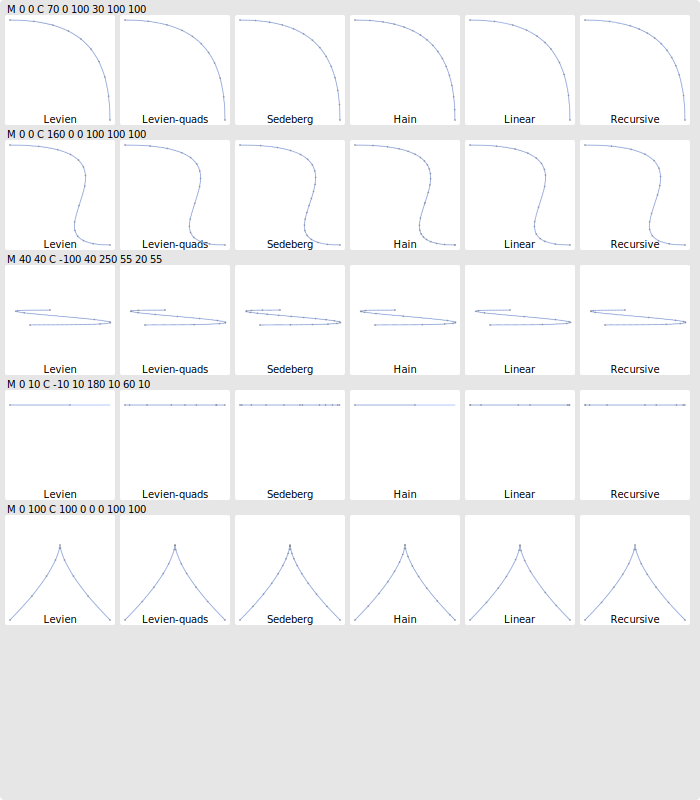

# Caveats

- I suspect that there may be a bug in `hain`'s implementation, so the results for that one are probably wrong.
- `levien-simd` was a half-baked attempt at sprinkling some sse in `levien`'s algorithm with underwhelming results. Raph levien has [a work in progress](https://gist.github.com/raphlinus/5f4e9feb85fd79bafc72da744571ec0e) avx2 version that is more promising.

# Algorthms

`Recursive` is the most straightforward recursive flattening algorithm, with a the following flatness criteria:
 - `recursive`: The flatness criterion implemented in lyon (TODO: find where it came from).
 - `recrusive-hfd`: The flatness criterion from "Hybrid forward differencing"
 - `recursive-agg`: The flatness criterion from [Antigrain Geometry](https://agg.sourceforge.net/antigrain.com/research/adaptive_bezier/index.html)

`Linear` is a rather naive sequential algorithm searching of the next split point at each step and splitting the flat part out of the curve once found. This algorithm is also implemented with the same three flatness criteria.

`Levien` is Raph Levien's flattening algorithm as implemented in Kurbo. It includes the fractional subdivision scheme when flattening cubic curves.

`Levien-quads` is Raph Levien's flattening algorithm without the fractional subdivision scheme. Cubic bézier curves are approximated with quadratics which are flattened independently.

`Hain` is an implementation of [Hain's paper: Precise flattening of cubic bézier curve segments](http://www.cccg.ca/proceedings/2004/36.pdf).

`Wang` is a fixed step flattening algorithm using Wang's formula to compute the number of subdivisions required to satisfy the tolerance parameter.

`Fwd-diff` is a simple implementation of forward differencing using Wang's formulat to compute the fixed flattening step.

`Hfd` is an implementation of the hybrid forward differencing algorithm which is used in WPF's rasterizer (a predecessor of Direct2D).

`Fixed-16` Simply split all curves into 16 segments at regular intervals (it does not satisfy a tolerance parameter).

# Performance

To run the benchmarks: `cargo bench`

The benchmark will pull all of the curves from the SVG documents in the `assets` directory. Use the `FLATTEN_INPUT` environment variable to apply a filter. For example:

```bash
FLATTEN_INPUT=nehab_ cargo bench
```

Will only use the files with "nehab_" in their name.

Benchmark results on an AMD Ryzen 7 PRO 6850U:


# Edge count

To produce the edge counts: `cargo test -- --nocapture`

The `FLATTEN_INPUT` environment variable to filter the input data set also applies.

Cubic bézier curves:

| tolerance  |  0.01 |  0.03 |  0.05 |  0.08 |  0.10 |  0.15 |  0.20 |  0.25 |  0.50 |  1.00 |
|-----------| -----:| -----:| -----:| -----:| -----:| -----:| -----:| -----:| -----:| -----:|
| recursive  | 2288133 | 1363025 | 1053950 | 823688 | 682307 | 587638 | 527562 | 467470 | 312577 | 236619 |
| recursive-agg| 3814692 | 2337272 | 1638428 | 1282680 | 1168123 | 991665 | 819131 | 703038 | 537764 | 353004 |
| recursive-hfd| 2633119 | 1737768 | 1217330 | 1035736 | 872545 | 681606 | 611383 | 562859 | 379523 | 284336 |
| linear     | 2255380 | 1413192 | 1000871 | 809250 | 704017 | 578272 | 498247 | 442774 | 316393 | 222637 |
| linear-agg | 3636330 | 2319000 | 1615960 | 1329778 | 1154745 | 934430 | 804512 | 721855 | 512802 | 360247 |
| linear-hfd | 2717150 | 1697988 | 1208779 | 983045 | 847696 | 694437 | 603526 | 539476 | 378934 | 270344 |
| levien     | 1675005 | 1064467 | 755259 | 620322 | 538777 | 441602 | 383721 | 344255 | 247813 | 178658 |
| levien-quads|1708642 | 1086097 | 772832 | 633980 | 550557 | 452222 | 393435 | 353538 | 254570 | 183731 |
| hain       | 3135836 | 1988972 | 1411183 | 1155309 | 1002741 | 821859 | 714078 | 640544 | 458168 | 329181 |
| wang       | 3206955 | 2032625 | 1440607 | 1178565 | 1022101 | 836656 | 726281 | 651107 | 463860 | 331359 |
| fwd-diff   | 3206955 | 2032625 | 1440607 | 1178565 | 1022101 | 836656 | 726281 | 651107 | 463860 | 331359 |
| hfd        | 2616409 | 1734954 | 1215441 | 1034111 | 871491 | 681503 | 611250 | 562894 | 379582 | 284342 |
| fixed-16   | 380928 | 380928 | 380928 | 380928 | 380928 | 380928 | 380928 | 380928 | 380928 | 380928 |


Quadratic bézier curves:

| tolerance  |  0.01 |  0.03 |  0.05 |  0.08 |  0.10 |  0.15 |  0.20 |  0.25 |  0.50 |  1.00 |
|-----------| -----:| -----:| -----:| -----:| -----:| -----:| -----:| -----:| -----:| -----:|
| recursive | 2269505 | 1351843 | 1046285 | 818341 | 676775 | 583200 | 524826 | 465572 | 311350 | 237241 |
| linear    | 2236352 | 1401608 | 992695 | 802519 | 698060 | 573823 | 494841 | 440007 | 314960 | 223257 |
| wang      | 1667590 | 1059932 | 753645 | 618369 | 536873 | 440975 | 383910 | 344832 | 248102 | 180451 |
| levien    | 1584246 | 1007326 | 716521 | 587875 | 510817 | 419637 | 365498 | 328538 | 237055 | 172876 |
| fwd-diff  | 1667590 | 1059932 | 753645 | 618369 | 536873 | 440975 | 383910 | 344832 | 248102 | 180451 |


