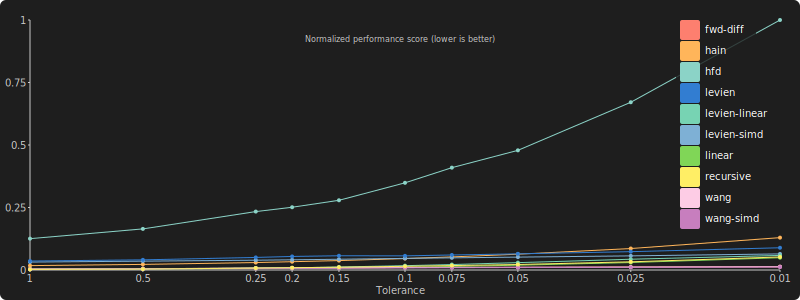
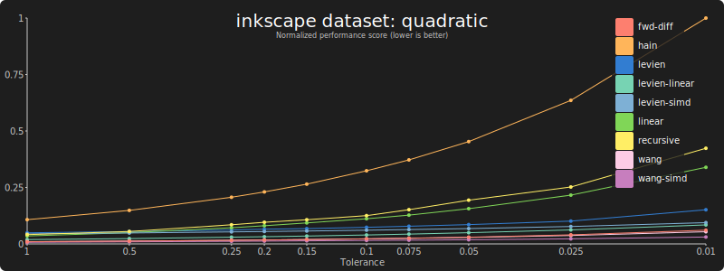
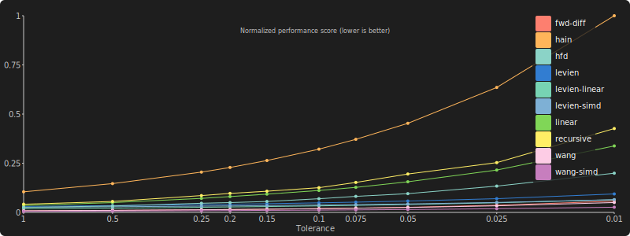
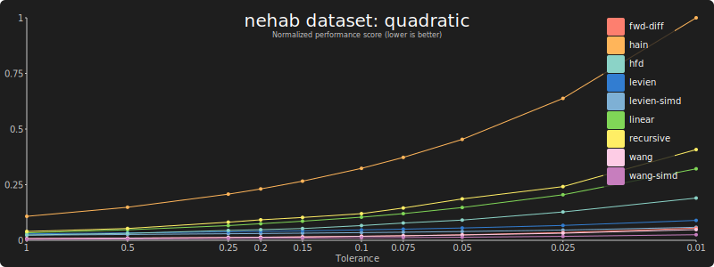
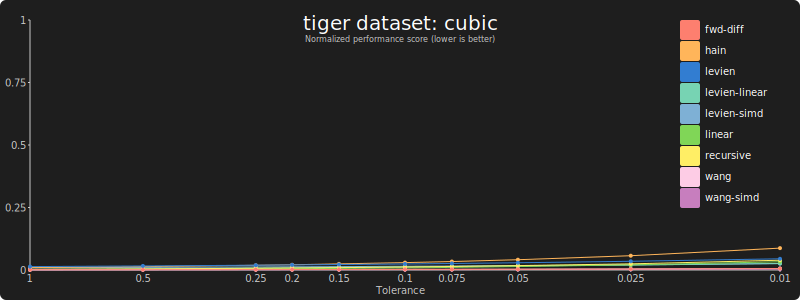
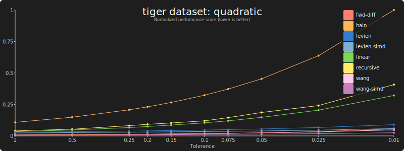
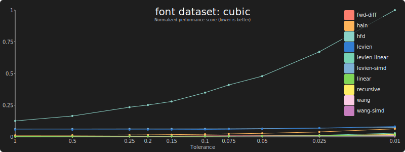
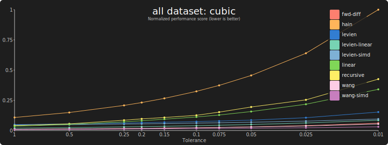
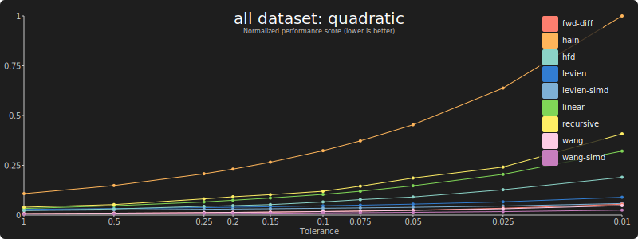

Benchmark results on an AMD Ryzen m1max PRO 3975WXs desktop:

## Inkscape

### Cubic bézier curves:

[Data](results/bench-cubic-inkscape-m1max.md)

### Quadratic bézier curves:

[Data](results/bench-quadratic-inkscape-m1max.md)

## Nehab

#### Cubic bézier curves:

[Data](results/bench-cubic-nehab-m1max.md)

#### Quadratic bézier curves:

[Data](results/bench-quadratic-nehab-m1max.md)

## Tiger

### Cubic bézier curves:

[Data](results/bench-cubic-tiger-m1max.md)

### Quadratic bézier curves:

[Data](results/bench-quadratic-tiger-m1max.md)

## Fonts

### Cubic bézier curves:

[Data](results/bench-cubic-font-m1max.md)

### Quadratic bézier curves:

[Data](results/bench-quadratic-font-m1max.md)

## All

### Cubic bézier curves:

[Data](results/bench-cubic-all-m1max.md)

### Quadratic bézier curves:

[Data](results/bench-quadratic-all-m1max.md)
