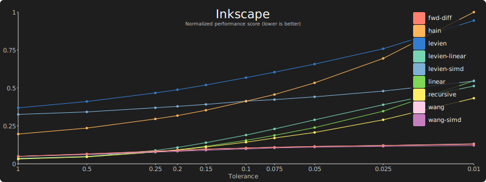
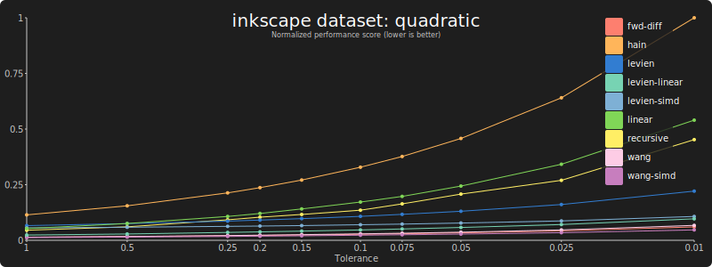
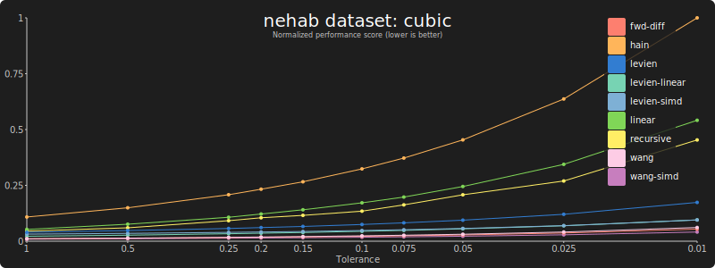
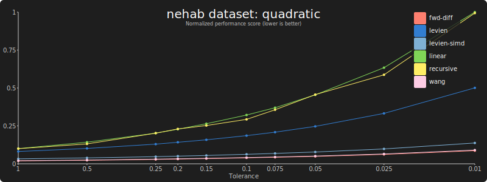
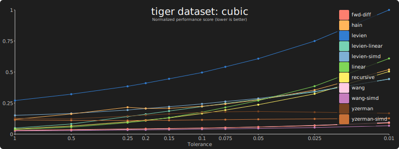
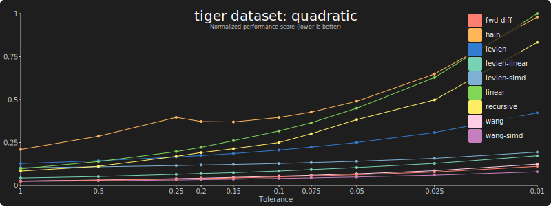
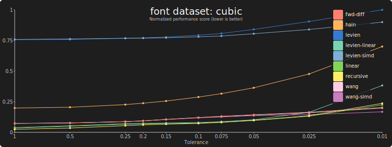
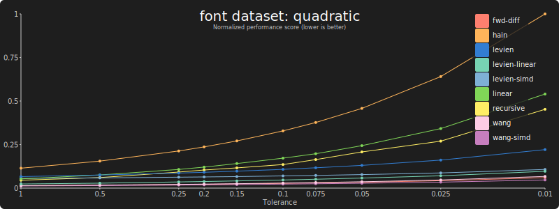
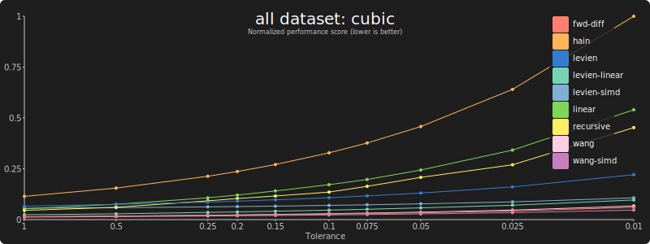
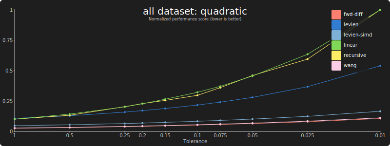

Benchmark results on an AMD Ryzen Threadripper PRO 3975WXs (zen 2) desktop:

## Inkscape

### Cubic bézier curves:

[Data](results/bench-cubic-inkscape-threadripper.md)

### Quadratic bézier curves:

[Data](results/bench-quadratic-inkscape-threadripper.md)

## Nehab

#### Cubic bézier curves:

[Data](results/bench-cubic-nehab-threadripper.md)

#### Quadratic bézier curves:

[Data](results/bench-quadratic-nehab-threadripper.md)

## Tiger

### Cubic bézier curves:

[Data](results/bench-cubic-tiger-threadripper.md)

### Quadratic bézier curves:

[Data](results/bench-quadratic-tiger-threadripper.md)

## Fonts

### Cubic bézier curves:

[Data](results/bench-cubic-font-threadripper.md)

### Quadratic bézier curves:

[Data](results/bench-quadratic-font-threadripper.md)

## All

### Cubic bézier curves:

[Data](results/bench-cubic-all-threadripper.md)

### Quadratic bézier curves:

[Data](results/bench-quadratic-all-threadripper.md)
