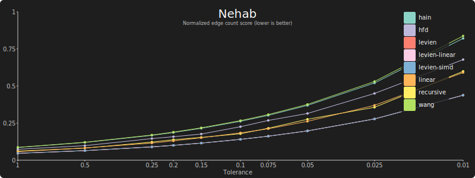

# Edge count

To produce the edge counts: `cargo test -- edge_count_cubic --nocapture`

The `FLATTEN_INPUT` environment variable to filter the input data set also applies.

## Inkscape

### Cubic bézier curves:

[Data](edge-count-cubic-inkscape.md) ([Normalized](edge-count-cubic-inkscape-normalized.md))[

### Quadratic bézier curves:

[Data](edge-count-quadratic-inkscape.md) ([Normalized](edge-count-quadratic-inkscape-normalized.md))

## Nehab

#### Cubic bézier curves:

[Data](edge-count-cubic-nehab.md) ([Normalized](edge-count-cubic-nehab-normalized.md))

#### Quadratic bézier curves:

[Data](edge-count-quadratic-nehab.md) ([Normalized](edge-count-quadratic-nehab-normalized.md))

## Tiger

### Cubic bézier curves:

[Data](edge-count-cubic-tiger.md) ([Normalized](edge-count-cubic-tiger-normalized.md))

### Quadratic bézier curves:

[Data](edge-count-quadratic-tiger.md) ([Normalized](edge-count-quadratic-tiger-normalized.md))

## Fonts

### Cubic bézier curves:

[Data](edge-count-cubic-font.md) ([Normalized](edge-count-cubic-font-normalized.md))

### Quadratic bézier curves:

[Data](edge-count-font-all.md) ([Normalized](edge-count-font-all-normalized.md))

## All

### Cubic bézier curves:

[Data](edge-count-cubic-all.md) ([Normalized](edge-count-cubic-all-normalized.md))

### Quadratic bézier curves:

[Data](edge-count-quadratic-all.md) ([Normalized](edge-count-quadratic-all-normalized.md))
