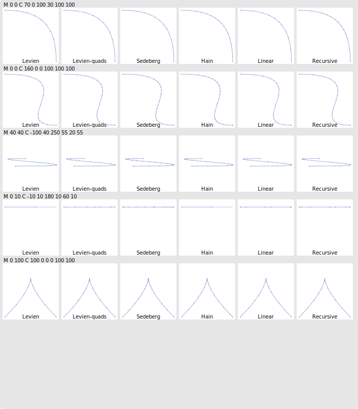

# Algorthms

`Recursive` is the most straightforward recursive flattening algorithm, with a the following flatness criteria:
 - `recursive`: The flatness criterion implemented in lyon (TODO: find where it came from).
 - `recrusive-hfd`: The flatness criterion from "Hybrid forward differencing"
 - `recursive-agg`: The flatness criterion from [Antigrain Geometry](https://agg.sourceforge.net/antigrain.com/research/adaptive_bezier/index.html)

`Linear` is a rather naive sequential algorithm searching of the next split point at each step and splitting the flat part out of the curve once found. This algorithm is also implemented with the same three flatness criteria.

[`Levien`](levien.md) is Raph Levien's flattening algorithm as implemented in Kurbo. It includes the fractional subdivision scheme when flattening cubic curves.

`Levien-quads` is Raph Levien's flattening algorithm without the fractional subdivision scheme. Cubic bézier curves are approximated with quadratics which are flattened independently.

`Hain` is an implementation of [Hain's paper: Precise flattening of cubic bézier curve segments](http://www.cccg.ca/proceedings/2004/36.pdf).

`Wang` is a fixed step flattening algorithm using Wang's formula to compute the number of subdivisions required to satisfy the tolerance parameter.

`Fwd-diff` is a simple implementation of forward differencing using Wang's formulat to compute the fixed flattening step.

`Hfd` is an implementation of the hybrid forward differencing algorithm which is used in WPF's rasterizer (a predecessor of Direct2D).

`Fixed-16` Simply split all curves into 16 segments at regular intervals (it does not satisfy a tolerance parameter).

# Performance

See [the benchmark results](../benches/readme.md)

# Flattening quality

See [the number of edges per curve](edge_count.md)

# Visualization



To generate this image, modify [`src/show.rs`](../src/show.rs) and run:

```
FLATTEN_OUTPUT=visualization.svg cargo test --release -- print_cubic --nocapture
```

# Caveats

- I suspect that there may be a bug in `hain`'s implementation, so the results for that one are probably wrong.
- A fair amount of effort has already gone into speeding up `levien` using 128-bit wide SIMD intrinsics. More effort is underway, most of the other algorithms did not get much performance work yet, so number will probably change.
